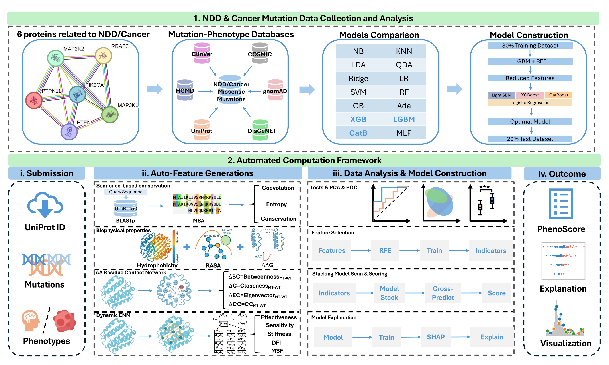

# protPheMut Interpretable Mutation Analysis

This repository provides analysis code, documentation, and reproducible workflow links associated with the study:

**protPheMut: An Interpretable Machine Learning Tool for Classification of Cancer and Neurodevelopmental Disorders in Human Missense Mutations.**

## Overview

protPheMut is a machine-learning framework for classifying phenotypic effects of human missense mutations, with a focus on distinguishing cancer-associated mutations from neurodevelopmental disorder (NDD)-associated mutations in the same disease-related proteins.

This repository is organized as a companion analysis and reproducibility repository. It documents the curated mutation datasets, feature engineering strategy, model construction and validation, benchmark comparisons, SHAP-based interpretation, and case studies described in the publication.

## Relationship to the protPheMut Web Server

Jingran Wang made major contributions to the development, deployment, and maintenance of the protPheMut web server. Miao Yang made major contributions to the development and testing of the protPheMut web server.

The main protPheMut web-server codebase is maintained by Jingran Wang at:

[https://github.com/Spencer-JRWang/protPheMut](https://github.com/Spencer-JRWang/protPheMut)

The web server is available at: [http://netprotlab.com/protPheMut/](http://netprotlab.com/protPheMut/)

## Dataset Scale

The curated dataset contains 2,114 missense mutations across six oncoproteins, including 490 NDD-associated mutations and 1,624 cancer-associated mutations.

| Protein | Mutations | NDD | Cancer |
| --- | ---: | ---: | ---: |
| MEK1 | 216 | 23 | 193 |
| MEK2 | 218 | 23 | 195 |
| PI3Kalpha | 782 | 154 | 628 |
| PTEN | 674 | 220 | 454 |
| RAS | 51 | 2 | 49 |
| SHP2 | 173 | 68 | 105 |
| Total | 2,114 | 490 | 1,624 |

## Feature Engineering

For each mutation, protPheMut integrates 15 sequence-, structure-, network-, and dynamics-related features:

- Entropy
- Coevolution
- Conservation score
- Relative accessible surface area
- Folding free-energy change
- Betweenness change
- Closeness change
- Eigenvector centrality change
- Clustering coefficient change
- Hydrophobicity change
- Effectiveness
- Sensitivity
- Mean-square fluctuation
- Dynamic flexibility index
- Stiffness

## Model Construction and Validation

The modeling workflow includes:

- Standard scaling of the integrated feature matrix
- Stratified 80/20 split into training and independent test sets
- LightGBM-based recursive feature elimination for feature selection
- 5-fold stratified cross-validation during the RFE and hyperparameter tuning stage
- 10-fold stratified cross-validation for final model training and evaluation
- Stacking ensemble modeling using GBM-family base models such as LightGBM, XGBoost, and CatBoost
- Logistic regression as the meta-model for final probability integration
- Independent test-set evaluation to assess generalization

For the overall dataset, LightGBM-based RFE selected 11 key features, and the optimized LightGBM/XGBoost stacking model achieved:

- Train cross-validation AUROC: 0.9118
- Independent test-set AUROC: 0.8925

## Benchmarking

protPheMut was benchmarked against commonly used mutation pathogenicity predictors, including:

- AlphaMissense
- EVMutation
- PolyPhen-2
- Rhapsody
- MutPred2
- SIFT
- FATHMM

Model performance was evaluated using AUROC, AUPRC, accuracy, precision, recall, specificity, sensitivity, F1 score, and Matthews correlation coefficient.

## Interpretability

The model uses SHAP explanations to improve interpretability. SHAP was used for both global feature-importance analysis and individual mutation-level interpretation, helping identify how sequence, structure, network, and dynamics features contribute to cancer- or NDD-associated predictions.

## Publication
Wang J#, Yang M#, Zong C, Li Y, Verkhivker G, Xiao F, Hu G.
protPheMut: An Interpretable Machine Learning Tool for Classification of Cancer and Neurodevelopmental Disorders in Human Missense Mutations.
Journal of Chemical Information and Modeling, 2025, 65(15): 8375-8384.
# Equal contribution.

## Notes
This repository emphasizes analysis documentation, reproducible workflow organization, and paper-related model interpretation. The full web-server implementation and deployment code are credited to Jingran Wang and are available at [https://github.com/Spencer-JRWang/protPheMut](https://github.com/Spencer-JRWang/protPheMut)
